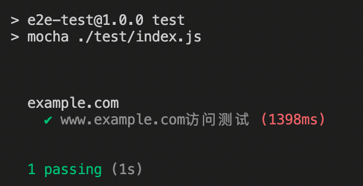
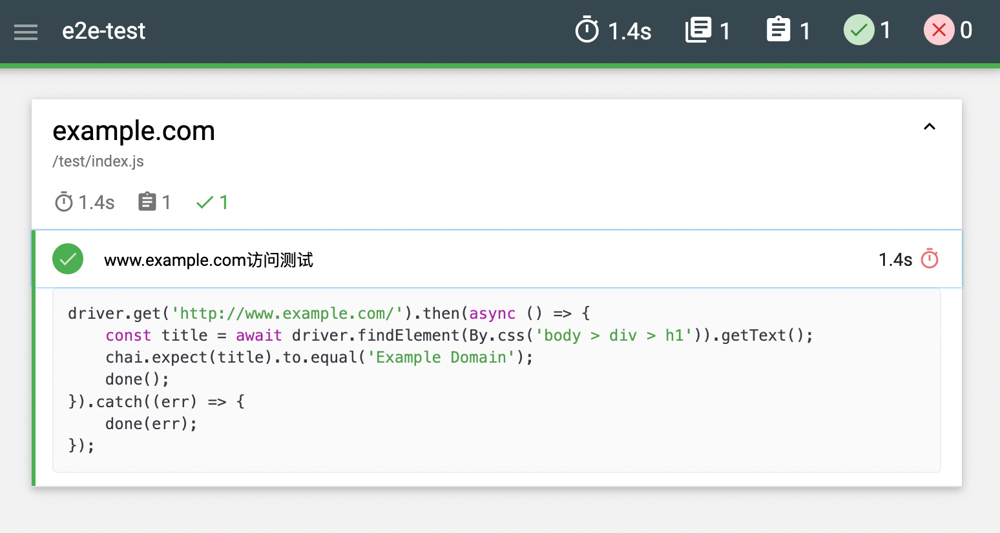

### 初始化项目，安装依赖

```bash
mkdir auto-test
cd ./auto-test
npm init
npm install chai chai-webdriver mocha selenium-webdriver
mkdir test
npm set-script test "mocha ./test/index.js"
```

### 下载驱动程序

选择所使用的浏览器下载对应版本的驱动程序，并解压放在项目文件夹下

<!-- more -->

* Chrome: [chromedriver(.exe)][chrome]
* Internet Explorer: [IEDriverServer.exe][release]
* Edge: [MicrosoftWebDriver.msi][edge]
* Firefox: [geckodriver(.exe)][geckodriver]
* Opera: [operadriver(.exe)][operadriver]
* Safari: [safaridriver]

### 代码示例

在 `test` 目录下创建 `index.js` 文件，并写入如下代码

```javascript
(async function run() {
    /**
     * 启动web驱动程序，供后续测试程序调用浏览器
     */
    const { Builder, Capabilities, By } = require('selenium-webdriver');
    const chrome = require('selenium-webdriver/chrome');
    const options = new chrome.Options(); // 新建配置
    options.addArguments([
        '--ignore-certificate-errors',
        '--ignore-ssl-errors',
    ]); // 处理SSL证书错误问题
    options.excludeSwitches([
        'enable-automation',
        'enable-logging',
    ]); // 忽略日志
    const driver = new Builder()
        .withCapabilities(Capabilities.chrome()) // 使用chrome浏览器
        .setChromeOptions(options) // 调用配置
        .build() // 启动驱动程序

    /**
     * 测试程序
     */
    const chai = require('chai');
    const chaiWebdriver = require('chai-webdriver');
    chai.use(chaiWebdriver(driver));
    describe('example.com', function () {
        it('www.example.com访问测试', function (done) {
            driver.get('http://www.example.com/').then(async () => {
                const title = await driver.findElement(By.css('body > div > h1')).getText();
                chai.expect(title).to.equal('Example Domain');
                done();
            }).catch((err) => {
                done(err);
            });
        });
    });
})();

```

### 运行

```bash
npm test
```

### 测试结果

如图所示



### 测试结果美化

通过 `mochawesome` 将命令行输出的测试结果生成为静态网页便于查看和保存
运行如下命令安装 `mochawesome`

```bash
npm install mochawesome
npm set-script test "mocha ./test/index.js --reporter mochawesome"
```

再次执行 `npm test` 运行测试程序后，就会在项目文件夹下生成 `mochawesome-report` 目录，打开 `./mochawesome-report/mochawesome.html` 就能查看测试结果了



### Q&A

* 超时报错: 如果出现超时报错可以在test命令后添加参数 `--timeout 10000` 将测试的超时时间设置的更长一些

> [selenium-webdriver](https://github.com/SeleniumHQ/selenium/tree/trunk/javascript/node/selenium-webdriver#readme)

[chrome]: http://chromedriver.storage.googleapis.com/index.html
[edge]: http://go.microsoft.com/fwlink/?LinkId=619687
[geckodriver]: https://github.com/mozilla/geckodriver/releases/
[release]: https://www.selenium.dev/downloads/
[safaridriver]: https://developer.apple.com/library/prerelease/content/releasenotes/General/WhatsNewInSafari/Articles/Safari_10_0.html#//apple_ref/doc/uid/TP40014305-CH11-DontLinkElementID_28
[operadriver]: https://github.com/operasoftware/operachromiumdriver/releases
